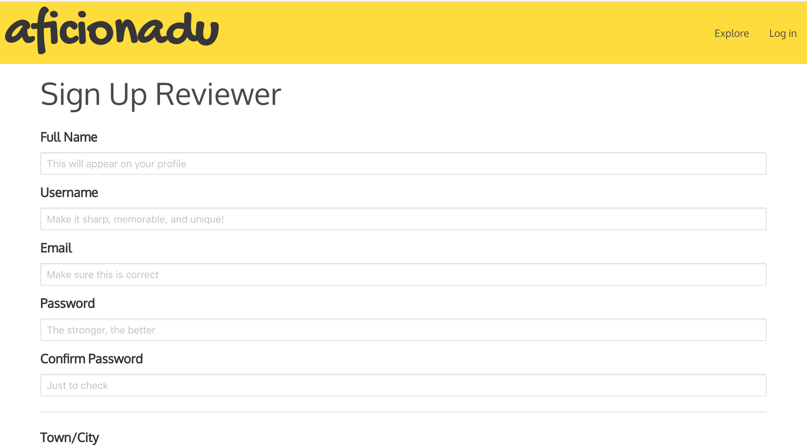

[Heroku](https://aficionadu.herokuapp.com/)

[GitHub Repo](https://github.com/platypotomus/wdi-project2-aficionadu)


Aficionadu is a restaurant review app, currently featuring a range of restaurants in London and Manchester. Users can sign up as either a restaurant and reviewer. This allows restaurants to have more control over their restaurant profiles. Meanwhile, reviewers can read and upload time-stamped reviews and photos.

Aficionadu is my second project from General Assembly's Web Development Immersive. It was an individual project built in one week, in July/August 2018. Aficionadu was my first dive into backend technologies.


## Home Page


## Index Page


## Show Page


## Reviewer Sign Up


## Profile Page


## Comment Moderation Page


## Featured Piece of Code no. 1
A function to calculate a restaurant's average rating. From [models/restaurant.js](https://github.com/platypotomus/wdi-project2-aficionadu/blob/master/models/restaurant.js).

```
restaurantSchema.virtual('averageRating')
  .get(function() {
    return (this.comments.reduce((sum, comment) => sum + comment.rating, 0) / this.comments.length).toFixed(1);
  });
  ```

---
## Brief
To create a RESTful restaurant review app, akin to a mini TripAdvisor. The app had to had to meet the following criteria:
* Has a User model and user authentication
* Has models for Restaurants and reviews
* Allows users to add, edit, and delete restaurants and reviews.
* Users can only delete the reviews and restaurants that they added.
* Is styled with Bulma, but doesn't look like Bulma


## Technologies Used
* JavaScript (ECMAScript 6)
* SCSS with Bulma and CSS animation
* Node.js
* MongoDB
* bcrypt: v3.0.0
* bluebird: v3.5.1
* body-parser: v1.18.3
* ejs: v2.6.1
* express: v4.16.3
* express-ejs-layouts: 2.4.0
* express-flash: v0.0.2
* express-session: v1.15.6
* method-override: v3.0.0
* mongoose: v5.2.5
* morgan: v1.9.0
* Git
* GitHub
* Heroku
* Google Fonts
* Fontawesome
* PhotoShop

## Approach Taken

### Wireframes
These wireframes are based on those kindly provided by GA's UXDI students, as well as TripAdvisor and Yelp.

#### Home Page


#### Index Page


#### Restaurant Show Page


#### New Restaurant Page


#### Profile Show Page


### Functionality
I hit MVP after one day of coding. This met the brief (minus the Bulma styling), and also included the two different types of account.

#### Home Page


#### Index Page


#### Show Page


#### Reviewer Sign Up Page


#### Profile Page


I next improved the reviewing experience, by allowing users to add a headline, a rating, and a photo with their review. Looking at TripAdvisor and Booking.com really inspired me to add more detail to this section. I also added a timestamp feature to the reviews.

Finally, I added review and photo moderation. This means that new reviews and photos do not appear on the main site until they have been approved by someone with a "moderator" type account. Moderators are able to delete reviews at this point.

## Featured Piece of Code no. 2
This function sets a review's status to moderated when a moderator clicks the "approve" button. The review and photo now appear on the restaurant's page. From [controllers/commentController.js](https://github.com/platypotomus/wdi-project2-aficionadu/blob/master/controllers/commentController.js).

```
function commentsSetModerated(req, res, next) {
  Restaurant
    .findById(req.params.restaurantId)
    .then(restaurant => {
      restaurant.comments.filter(comment => comment.id === req.params.commentId).forEach(
        comment => comment.moderated = true
      );
      return restaurant.save();
    })
    .then(restaurant => res.redirect(`/restaurants/${restaurant.id}`))
    .catch(next);
}
```

### Styling
I found a colour scheme on Canva which I felt captured the essence of my app. I used two Google Fonts: Oxygen for the main text, and Gochi Hand for the app name. Fonteawesome was great to add extra detail to the app.

I designed the default profile pictures and badges in PhotoShop. For these, I used blue for reviewer accounts, and peach for restaurant accounts.

#### Default Profile Pictures


#### Badges for Reviewers


#### Badges for Restaurants


## Wins and Blockers
A big win was how quickly and smoothly I got the app's basic functionality working, including its RESTful routes.

User moderation was a blocker. I found it easy to add the DELETE comment feature, but less so to allow comments to be approved. This was fixed by attaching a PATCH request to the approve button.

Bulma was also somewhat of a challenge, since I hadn't used it much before. I had a clear idea of what I wanted the app to look like, and sometimes felt Bulma was hard to work with in that way, and that it was hard to make the app not look like Bulma defaults. But after some customisation, I managed to design an app I was happy with.

## Future Features
There are a number of features I plan to add to Aficionadu, including:

* A search feature.
* A filter feature.
* Review upvoting/downvoting.
* Review replies.
* User's activity to appear on their profiles.
* Getting the badge system working.
* A model with a carousel on the restaurant show pages, so users can view the photos clearly. This could also have the uploader's name, review, and timestamp.
* Improved mobile responsiveness.


